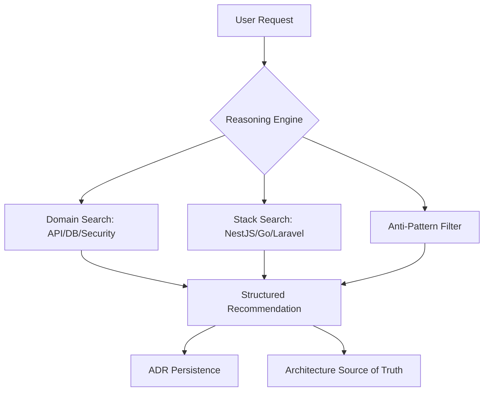

# Backend Arch Pro Max
 
<p align="center">
  
  
  
  
</p>
 
Backend Arch Pro Max is an AI coding-agent skill for backend architecture decisions, API design, database design, caching, async processing, resilience, security, observability, and anti-pattern review.
 
It follows the same broad pattern as UI/UX Pro Max: searchable rules, a lightweight reasoning engine, structured recommendations, and a pre-delivery checklist.
 
## Architecture Overview
 

 
## What It Covers

- API contracts: REST, GraphQL, gRPC, tRPC, pagination, versioning, webhooks, streaming, and error envelopes.
- Database architecture: service layer, repository pattern, transactions, indexing, tenancy, migrations, locking, backups, and CDC.
- Caching: Redis, cache-aside, write-through, invalidation, cache stampede control, tenant-scoped keys, and cache observability.
- Resilience: timeouts, retries, circuit breakers, bulkheads, sagas, quotas, canaries, reconciliation, and graceful degradation.
- Security: OAuth2/OIDC, JWT, RBAC, ABAC, password hashing, webhook verification, CSRF, CORS, SSRF, encryption, and audit events.
- Async systems: queues, outbox, inbox, Kafka, RabbitMQ, DLQ, idempotency, workflows, delayed retries, and job progress.
- Observability: structured logs, correlation IDs, traces, metrics, SLOs, audit logs, queue metrics, and deployment markers.
- Anti-patterns: N+1 queries, hardcoded secrets, cross-tenant leaks, unsafe retries, exposed stack traces, missing transactions, and more.

## Dataset

Current dataset size: **333 rows**.

| File | Rows |
| --- | ---: |
| `api_patterns.csv` | 40 |
| `database_patterns.csv` | 40 |
| `caching_strategies.csv` | 25 |
| `resilience_patterns.csv` | 25 |
| `security_patterns.csv` | 40 |
| `async_patterns.csv` | 30 |
| `observability_patterns.csv` | 25 |
| `anti_patterns.csv` | 60 |
| `integrations.csv` | 16 |
| `stacks.csv` | 32 |

Validate the CSV files:

```powershell
python src\backend-arch-pro-max\data\_sync_all.py
```

## Usage
 
Search for patterns and generate architectures directly from the CLI:
 
```bash
# Generate architecture recommendation
npx backend-arch-pro-max search "multi-tenant saas auth" --architecture
 
# Search specific domains
npx backend-arch-pro-max search "jwt refresh" --domain security
npx backend-arch-pro-max search "redis cache aside" --domain caching
 
# Filter by stack
npx backend-arch-pro-max search "nestjs repository" --stack nestjs
```
 
## CLI Installer
 
Install the skill into your project directory:
 
```bash
# Auto-detects platform (Cursor, Claude, Windsurf, Codex)
npx backend-arch-pro-max init
 
# Or specify manually
npx backend-arch-pro-max init --ai cursor
```
 
### CLI Arguments
 
| Argument | Description |
| --- | --- |
| `--ai <platform>` | The platform you are using (e.g., `claude`, `cursor`, `windsurf`, `codex`). Auto-detected if omitted. |
| `--target <dir>` | The destination project directory. Defaults to current directory (`.`). |
| `--force` | Overwrites existing files if the skill was already installed. |

### Co-existence with UI/UX Pro Max

This skill is designed to live harmoniously with other "Pro Max" skills like **UI/UX Pro Max**. 

- Both skills will be installed under the `.agent/skills/` directory (for Antigravity).
- Your AI assistant will be able to search and utilize both rule sets simultaneously.
- If you notice one tool uses `.agent` and another uses `.agents`, ensure you are using the latest version of `backend-arch-pro-max-cli` (v0.1.0+) which standardizes on `.agent` for Antigravity.

---

Supported platform templates currently include Codex, Claude, Cursor, Windsurf, and Antigravity.

## Platform Template Generator

Platform templates are generated from a single source file and should not be edited manually.

Generate templates:

```powershell
python scripts\generate_platform_templates.py
```

Validate generated templates without writing changes:

```powershell
python scripts\generate_platform_templates.py --check
```

## Skill Structure

```text
backend-arch-pro-max-skill/
|-- SKILL.md
|-- README.md
|-- skill.json
|-- agents/openai.yaml
|-- cli/
|-- docs/REFERENCE.md
|-- examples/
|-- scripts/search.py
|-- templates/platforms/
|-- tests/test_search.py
`-- src/backend-arch-pro-max/data/
```

## Validation

```powershell
python C:\Users\USER\.codex\skills\.system\skill-creator\scripts\quick_validate.py .
$env:PYTHONDONTWRITEBYTECODE='1'; python src\backend-arch-pro-max\data\_sync_all.py
$env:PYTHONDONTWRITEBYTECODE='1'; python -m unittest tests\test_search.py
node cli\bin\backend-arch-pro-max.js list
node cli\bin\backend-arch-pro-max.js init --ai codex --target . --dry-run
npm --prefix cli pack --dry-run
```

## Release
 
- Current release version: `0.1.0`.
- Tag format: `v*` (example: `v0.1.0`).
- CI release workflow file: `.github/workflows/release.yml`.
- npm publish requires repository secret `NPM_TOKEN`.
- GitHub Release notes are sourced from `RELEASE_NOTES.md`.

## Roadmap

- Add more platform templates from `templates/platforms/source.json`.
- Add integration guidance with UI/UX Pro Max, DevOps Pro Max, QA Pro Max, and AppSec Pro Max.
- Add more realistic generated architecture examples.
